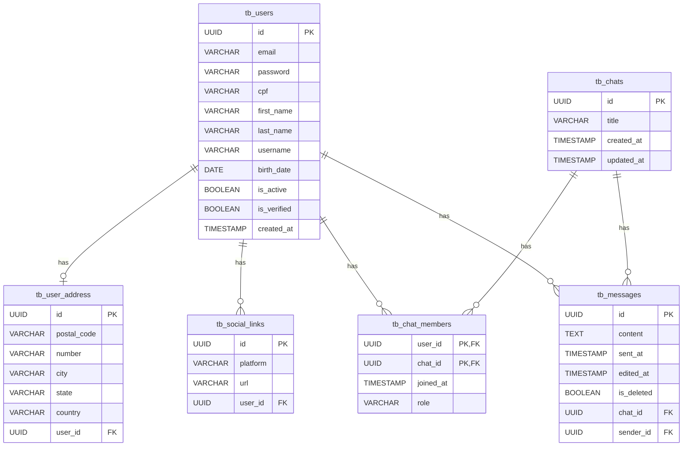

# Banco de Dados

## Tabela

```mermaid
erDiagram
    direction TB

    tb_users ||--|O tb_user_address : has
    tb_users ||--o{ tb_social_links : has
    tb_users ||--o{ tb_chat_members : has
    tb_users ||--o{ tb_messages : has
    tb_chats ||--o{ tb_chat_members : has
    tb_chats ||--o{ tb_messages : has

    tb_users {
        UUID id PK
        VARCHAR email
        VARCHAR password
        VARCHAR cpf
        VARCHAR first_name
        VARCHAR last_name
        VARCHAR username
        DATE birth_date
        BOOLEAN is_active
        BOOLEAN is_verified
        TIMESTAMP created_at
    }

    tb_user_address {
        UUID id PK
        VARCHAR postal_code
        VARCHAR number
        VARCHAR city
        VARCHAR state
        VARCHAR country
        UUID user_id FK
    }

    tb_social_links {
        UUID id PK
        VARCHAR platform
        VARCHAR url
        UUID user_id FK
    }

    tb_chats {
        UUID id PK
        VARCHAR title
        TIMESTAMP created_at
        TIMESTAMP updated_at
    }

    tb_chat_members {
        UUID user_id PK, FK
        UUID chat_id PK, FK
        TIMESTAMP joined_at
        VARCHAR role
    }

    tb_messages {
        UUID id PK
        TEXT content
        TIMESTAMP sent_at
        TIMESTAMP edited_at
        BOOLEAN is_deleted
        UUID chat_id FK
        UUID sender_id FK
    }
```
